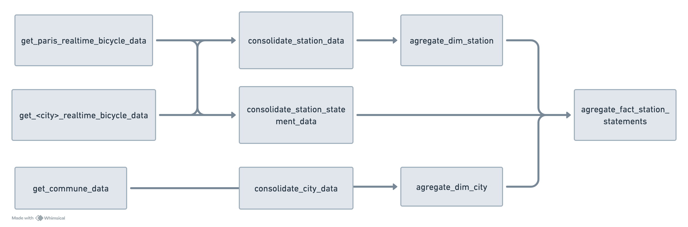

# Introduction à l'ingénierie des données - Exercice pratique
## Résumé
Ce projet consiste en la création d’un pipeline ETL (Extraction, Transformation, Chargement) destiné à ingérer, transformer et stocker des données en temps réel sur les stations de vélos en libre-service dans différentes villes de France. L’objectif était d’enrichir un pipeline ETL existant en y ajoutant des données provenant de nouvelles villes ainsi que des données descriptives supplémentaires issues d’une API gouvernementale.

Le pipeline est développé en Python et utilise DuckDB comme entrepôt de données local ou en mémoire pour le stockage et la transformation des données.

## Sujet du TP
Le but de ce TP est d'enrichir un pipeline ETL avec des données provenant d'autres villes. Les sources de données disponibles sont :
- [Open data Nantes](https://data.nantesmetropole.fr/explore/dataset/244400404_stations-velos-libre-service-nantes-metropole-disponibilites/api/)
 
- [Open data Toulouse](https://data.toulouse-metropole.fr/explore/dataset/api-velo-toulouse-temps-reel/api/)
 
- [Open data communes](https://geo.api.gouv.fr/communes)

Voici à quoi ressemble le pipeline ETL final:



## Documentation du projet
La section suivante explique le code que j'ai ajouté au projet afin d'enrichir le pipeline ETL avec des données provenant de nouvelles villes et des données descriptives supplémentaires issues d'une API gouvernementale.

### Data ingestion

Le code suivant stocke les données brutes après un appel à l'API Open Data des communes.


```python
def get_commune_data():
    url = "https://geo.api.gouv.fr/communes"
    response = requests.get(url)
    response.encoding = 'utf-8'
    serialize_data(response.text, "commune_data.json")
```

La même opération est effectuée pour les données provenant des API Open Data de Nantes et Toulouse.

```python
def get_nantes_realtime_bicycle_data():
    url = "https://data.nantesmetropole.fr/api/explore/v2.1/catalog/datasets/244400404_stations-velos-libre-service-nantes-metropole-disponibilites/records?limit=100"
    response = requests.request("GET", url)
    json_data = response.json()
    table_of_records = json_data.get("results", [])
    serialize_table_of_records(table_of_records, "nantes_realtime_bicycle_data.json")
```

En raison de la structure différente des données provenant des API de Toulouse et de Nantes, la fonction suivante est utilisée pour stocker les données :

```python
def serialize_table_of_records(table_of_records, file_name):
    today_date = datetime.now().strftime("%Y-%m-%d")

    if not os.path.exists(f"data/raw_data/{today_date}"):
        os.makedirs(f"data/raw_data/{today_date}")

    with open(f"data/raw_data/{today_date}/{file_name}", 'w', encoding='utf-8') as file:
        json.dump(table_of_records, file, ensure_ascii=False, indent=4)
```

### Data consolidation

La fonction suivante est utilisée pour obtenir le code INSEE d'une ville. Elle utilise les données de la table CONSOLIDATE_CITY dans la base de données DuckDB :

```python
def get_INSEE_code(city_name):
    duckdb_path = "data/duckdb/mobility_analysis.duckdb"
    connection = duckdb.connect(duckdb_path)
    insee = connection.execute(f"SELECT ID FROM CONSOLIDATE_CITY WHERE  NAME = '{city_name.capitalize() }'    ").fetchdf()
    insee = insee["ID"][0]
    return insee
```

Les fonctions suivantes sont utilisées pour ajouter les données des API de Nantes et de Toulouse au pipeline :

```python
def add_city_data(json_file, city_code,):
    with open(f"data/raw_data/{today_date}/{json_file}", encoding='UTF-8') as fd:
        city_data = json.load(fd)

    city_name = city_data[0]["contract_name"]
    insee_code = get_INSEE_code(city_name)

    city_raw_data_df = pd.json_normalize(city_data)
    city_raw_data_df["id"] = city_raw_data_df["number"].apply(lambda x: f"{city_code}-{x}")
    city_raw_data_df['status'] = city_raw_data_df['status'].apply(lambda x: 'OUI' if x == 'OPEN' else 'NON')
    city_raw_data_df["created_date"] = date.today()
    city_raw_data_df["code_insee_commune"] = insee_code
    city_station_data_df = city_raw_data_df[[
        "id",
        "number",
        "name",
        "contract_name",
        "code_insee_commune",
        "address",
        "position.lon",
        "position.lat",
        "status",
        "created_date",
        "bike_stands"
    ]]

    city_station_data_df.rename(columns={
        "number": "code",
        "name": "name",
        "position.lon": "longitude",
        "position.lat": "latitude",
        "status": "status",
        "contract_name": "city_name",
        "code_insee_commune": "city_code",
        "bike_stands": "capacity"
    }, inplace=True)
    return city_station_data_df
```

```python
def add_station_statement_data(json_file, city_code):
    with open(f"data/raw_data/{today_date}/{json_file}") as fd:
        data = json.load(fd)

    raw_data_df = pd.json_normalize(data)
    raw_data_df["station_id"] = raw_data_df["number"].apply(lambda x: f"{city_code}-{x}")
    raw_data_df["created_date"] = date.today()
    station_statement_data_df = raw_data_df[[
        "station_id",
        "available_bike_stands",
        "available_bikes",
        "last_update",
        "created_date"
    ]]

    station_statement_data_df.rename(columns={
        "available_bike_stands": "bicycle_docks_available",
        "available_bikes": "bicycle_available",
        "last_update": "last_statement_date",
    }, inplace=True)
    return station_statement_data_df
```

Ces fonctions sont intégrées respectivement aux fonctions **consolidate_station_data** et **consolidate_station_statement_data** de la manière suivante :

```python
    if add_info:
        nantes_station_data_df = add_city_data("nantes_realtime_bicycle_data.json", NANTES_CITY_CODE )
        toulouse_station_data_df = add_city_data("toulouse_realtime_bicycle_data.json", TOULOUSE_CITY_CODE)
        all_data = pd.concat([paris_station_data_df, nantes_station_data_df, toulouse_station_data_df])
    else:
        all_data = paris_station_data_df

    con.execute("INSERT OR REPLACE INTO CONSOLIDATE_STATION SELECT * FROM all_data;")
```

```python
    if add_info:
        nantes_station_statement_data_df = add_station_statement_data("nantes_realtime_bicycle_data.json", NANTES_CITY_CODE)
        toulouse_station_statement_data_df = add_station_statement_data("toulouse_realtime_bicycle_data.json", TOULOUSE_CITY_CODE)
        all_data = pd.concat([paris_station_statement_data_df, nantes_station_statement_data_df, toulouse_station_statement_data_df])
    else:
        all_data = paris_station_statement_data_df


    con.execute("INSERT OR REPLACE INTO CONSOLIDATE_STATION_STATEMENT SELECT * FROM all_data;")
```

## Conclusion
Ce projet m'a permis de comprendre le fonctionnement d'un pipeline ETL et de l'enrichir avec des données provenant de nouvelles villes et des données descriptives supplémentaires issues d'une API gouvernementale. J'ai appris à manipuler des données brutes, à les stocker dans un entrepôt de données local et à les transformer pour les rendre exploitables. J'ai également appris à utiliser des outils tels que DuckDB pour stocker et manipuler des données en mémoire. Ce projet m'a permis de mettre en pratique mes compétences en Python et en manipulation de données.

## Comment faire fonctionner ce projet?
```
git clone https://github.com/fadimani/TP_DATA.git

cd TP_DATA

python3 -m venv .venv

source .venv/bin/activate

pip install -r requirements.txt

python main.py


```


